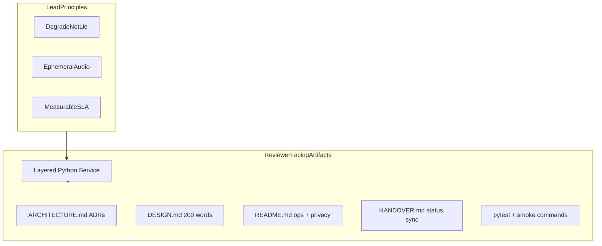

# Voice Analytics Backend — Engineering Plan

## North star (what reviewers actually score)

From [HANDOVER.md](HANDOVER.md): with AI allowed, the bar is **trust on a live logistics call stack**, not SOTA ML.


| Signal you must demonstrate in code + docs | How the repo proves it                                                                                                                                            |
| ------------------------------------------ | ----------------------------------------------------------------------------------------------------------------------------------------------------------------- |
| Graceful degradation                       | `audio_quality` + `unknown` driven by measurable rules in `[app/utils/quality.py](app/utils/quality.py)` and `[app/utils/confidence.py](app/utils/confidence.py)` |
| Privacy / PII                              | In-memory pipeline; temp files deleted; no audio in logs; dedicated README section                                                                                |
| Real-time suitability                      | Preloaded model, 5s speech cap, `processing_ms` + stage timings                                                                                                   |
| Defensibility                              | `[ARCHITECTURE.md](ARCHITECTURE.md)` ADRs, `[DESIGN.md](DESIGN.md)`, `[HANDOVER.md](HANDOVER.md)` aligned with code                                               |
| Backend > ML                               | One model, strong pipeline; reject Whisper/ensembles in ADR-001                                                                                                   |


**Anchor sentence** (use in README, DESIGN.md, and discussion):

> Caller audio is ephemeral PII; we infer only on VAD-trimmed speech after quality checks, return **unknown** when confidence is low, and expose **audio_quality** so agents do not over-personalize on warehouse or truck noise.

---

## Current state

- **Repo:** Greenfield — [README.md](README.md), [.gitignore](.gitignore), [HANDOVER.md](HANDOVER.md), plan only.
- **No `app/` yet.** Implementation starts at Step 1 after plan approval.

---

## Engineering-lead posture (how this plan differs from a “junior take-home”)

You are not building “a model that works.” You are delivering a **small production service** with:

1. **Explicit boundaries** — layer contracts, dependency rule, mockable interfaces
2. **Policy as code** — quality and confidence rules centralized, tested, env-tunable
3. **Operational contracts** — health check, structured logs, error taxonomy, latency fields
4. **Decision traceability** — ADRs in ARCHITECTURE.md (why chosen / why rejected)
5. **Submission narrative** — docs that a staff engineer would approve in PR review




---

## Architecture (unchanged core, lead-level enforcement)

### Layered design

```
api/          → HTTP/WS only; maps errors to status codes
services/     → AnalysisService, StreamSessionService; owns pipeline policy
models/       → AgeGenderModel; preload + predict(); no FastAPI imports
utils/        → Pure functions: decode, VAD, quality, confidence
```

**Dependency rule:** `api → services → models | utils`. Never upward.

### Key interfaces (define in code early — Step 1)


| Interface                                                       | Owner    | Responsibility                           |
| --------------------------------------------------------------- | -------- | ---------------------------------------- |
| `AnalysisService.analyze(bytes, contact_id) -> AnalyzeResponse` | services | Single orchestration entry for REST + WS |
| `AgeGenderModel.predict(waveform, sr) -> ModelOutput`           | models   | Raw gender + age + scores only           |
| `QualityReport` + `assess_quality(waveform, speech_mask)`       | utils    | Returns `good | degraded | insufficient` |
| `apply_confidence(raw, quality_flag) -> Predictions`            | utils    | Forces `unknown` per policy              |


This lets you **unit-test policy without loading a 1GB model** — a lead-level move interviewers notice.

### Endpoints


| Endpoint        | Contract                                                                     |
| --------------- | ---------------------------------------------------------------------------- |
| `POST /analyze` | Multipart `audio` + optional `contact_id`; or raw `audio/`* + `X-Contact-Id` |
| `WS /ws/stream` | Binary chunks + `{"type":"end"}`; emits `partial` / `final`                  |
| `GET /health`   | `{"status":"ok","model_loaded":true}`                                        |


Response JSON must match the assignment spec exactly ([HANDOVER.md §3](HANDOVER.md)).

---

## ADRs to document in ARCHITECTURE.md (write as you implement)


| ID      | Decision                                           | Rationale                                          | Rejected                         |
| ------- | -------------------------------------------------- | -------------------------------------------------- | -------------------------------- |
| ADR-001 | `audeering/wav2vec2-large-robust-24-ft-age-gender` | One pass; noisy-speech robust; Docker-only weights | Whisper (latency), external APIs |
| ADR-002 | Quality gate **before** inference                  | Avoid misleading labels on truck noise             | Infer-then-hope                  |
| ADR-003 | `unknown` + confidence floors                      | Product trust > fake precision                     | Always predict                   |
| ADR-004 | ffmpeg for decode                                  | Telephony codecs (μ-law, MP3, GSM)                 | librosa-only load                |
| ADR-005 | webrtcvad pre-model                                | Less non-speech; better SNR estimate               | Raw full clip to model           |
| ADR-006 | CPU + preload in lifespan                          | Portability for take-home                          | Runtime model download           |
| ADR-007 | Shared `AnalysisService` for REST + WS             | One policy path; no drift                          | Duplicate pipelines              |


---

## Audio pipeline (implementation contract)

Ordered steps inside `AnalysisService`:

1. **Validate** — max 10MB, non-empty (`[app/utils/audio_validate.py](app/utils/audio_validate.py)`)
2. **Decode** — ffmpeg → 16 kHz mono float32 (`[app/utils/audio_decode.py](app/utils/audio_decode.py)`)
3. **VAD** — webrtcvad; concatenate speech; cap 5s (`[app/utils/vad.py](app/utils/vad.py)`)
4. **Quality** — speech_ms, clip ratio, RMS, est. SNR → flag (`[app/utils/quality.py](app/utils/quality.py)`)
5. **Inference** — skip if `insufficient` (`[app/models/age_gender_model.py](app/models/age_gender_model.py)`)
6. **Confidence** — floors, degraded cap 0.6, gender margin (`[app/utils/confidence.py](app/utils/confidence.py)`)
7. **Respond** — Pydantic schema + `processing_ms`

### Quality thresholds (centralize in `[app/config.py](app/config.py)`)


| Signal          | Threshold            | Flag                         |
| --------------- | -------------------- | ---------------------------- |
| Speech duration | < 500ms              | `insufficient`               |
| Clipping        | > 5% near full scale | `degraded`                   |
| Est. SNR        | < 6 dB               | `degraded`                   |
| RMS (speech)    | below floor          | `insufficient` or `degraded` |


### Confidence policy


| Rule              | Value                        |
| ----------------- | ---------------------------- |
| `GENDER_MIN_CONF` | 0.55                         |
| `AGE_MIN_CONF`    | 0.45                         |
| Degraded cap      | `min(conf, 0.6)`             |
| Gender margin     | top-2 gap < 0.15 → `unknown` |
| Insufficient      | force `unknown`, conf 0.0    |


---

## Latency budget and observability (operational contract)


| Stage           | Budget    |
| --------------- | --------- |
| ffmpeg          | 30–80ms   |
| VAD + quality   | 20–50ms   |
| wav2vec2-24 CPU | 250–400ms |
| Overhead        | <20ms     |


**Lead requirements:**

- Model loaded in **lifespan**; fail `/health` if not ready
- `[app/middleware/timing.py](app/middleware/timing.py)`: `processing_ms` in body; `X-Request-Id` header
- Structured JSON logs (`[app/utils/logging.py](app/utils/logging.py)`): `request_id`, `contact_id`, `stage`, `duration_ms`, `audio_quality` — **never** audio bytes
- Per-stage `timed_stage()` in `AnalysisService` for discussion-ready breakdowns

---

## Privacy (non-negotiable; document in README)

- Audio: `bytes` / `np.ndarray` only for request lifetime
- ffmpeg: `NamedTemporaryFile(delete=True)` + `finally` unlink
- WS: buffer cleared on disconnect
- Logs: metadata only
- Disclaimer: estimates for UX personalization, not identity or compliance

---

## Repository layout

```
Ironman/
├── app/
│   ├── main.py, config.py, schemas.py, dependencies.py
│   ├── middleware/timing.py
│   ├── api/{routes,analyze,stream}.py
│   ├── services/{analysis_service,stream_session}.py
│   ├── models/age_gender_model.py
│   └── utils/{audio_decode,audio_validate,vad,quality,confidence,logging}.py
├── tests/unit/ + tests/integration/
├── samples/test_clip.wav + samples/README.md
├── scripts/{ws_client,download_sample}.sh
├── requirements.txt          # pinned for reproducible Docker
├── Dockerfile
├── docker-compose.yml
├── README.md                 # setup, curl, privacy, limitations
├── ARCHITECTURE.md           # diagrams + ADRs + scaling
├── DESIGN.md                 # ~200 words for submission
└── HANDOVER.md               # update §5 status after each step
```

---

## Implementation phases (with Definition of Done)

Each phase ends with a **verifiable gate** — how a lead signs off their own work.

### Phase 1 — Foundation (Steps 1–2)

**Build:** scaffold, config, schemas, `/health`, timing middleware, exception handlers, audio validate + ffmpeg decode.

**DoD:**

- `uvicorn app.main:app` starts
- `/health` returns 200
- Decode unit test: synthetic WAV → 16k float32 array
- `config.py` documents every threshold with comment linking to ADR-002/003

### Phase 2 — Policy layer (Step 3)

**Build:** VAD, quality scorer, confidence utils + unit tests (no ML).

**DoD:**

- Silence-only → `insufficient`
- Synthetic clipped/noisy signals → `degraded` in tests
- Low conf inputs → `unknown` in `test_confidence.py`
- **Demo-ready for discussion:** pipeline stages 1–4 explainable without GPU

### Phase 3 — Inference core (Steps 4–5)

**Build:** `AgeGenderModel` + lifespan preload; `AnalysisService` full orchestration.

**DoD:**

- Model loads once; second request has no cold-start spike
- Bracket mapping tests at ages 30, 45, 60 boundaries
- `AnalysisService` returns valid `AnalyzeResponse` from in-memory WAV (mock or real model)

### Phase 4 — API surface (Steps 6–7)

**Build:** `POST /analyze` (multipart + raw); `WS /ws/stream`.

**DoD:**

- curl multipart returns contract JSON
- Raw stream path works with `Content-Type: audio/wav`
- WS emits `partial` on cadence (~1.5s), `final` on end
- Error codes: 413, 415, 422, 503 as specified

### Phase 5 — Ship gate (Steps 8–10)

**Build:** Docker, tests, docs.

**DoD:**

- `docker compose up --build` → health + analyze succeed
- `pytest -q` green (mock model in unit tests; optional `@pytest.mark.slow` integration)
- README: setup, model rationale, privacy, smoke curl, limitations
- DESIGN.md: ~200 words (template in HANDOVER §11)
- ARCHITECTURE.md: diagram + ADRs + scale-to-1k section
- **HANDOVER.md §5** updated with ✅ per step and any deviations

---

## Two-day execution strategy (lead prioritization)


| Priority | Must ship                                                        | Why                             |
| -------- | ---------------------------------------------------------------- | ------------------------------- |
| P0       | Phases 1–3 + `POST /analyze` + Docker + 1 test + README + DESIGN | Passes assignment core          |
| P1       | WebSocket + ARCHITECTURE ADRs                                    | Strong bonus + discussion depth |
| P2       | Eval harness / language detection                                | Only if P0/P1 solid             |


**Timebox rule:** If latency > 500ms on CPU, document in README and ADR-006 follow-up (ONNX)—do not block ship on optimization.

---

## Scaling narrative (for DESIGN.md + discussion)

Include in [ARCHITECTURE.md](ARCHITECTURE.md) — not implemented, but shows lead thinking:

1. Stateless API pods (I/O, VAD, quality) vs GPU inference workers (Redis queue)
2. WebSocket sticky sessions; ~200–300 conn/pod; backpressure at queue depth
3. ONNX/TensorRT for 2–4× throughput
4. Batching 8–16 on GPU workers
5. Optional Kafka if analytics tolerates +100ms
6. State assumptions explicitly when sizing 1k calls

---

## Code quality bar (enforce in every PR to yourself)

- **Typing:** Pydantic v2 models for all API I/O; type hints on service/utils public functions
- **Config:** No magic numbers in business logic — all thresholds in `config.py`
- **Errors:** Custom exception hierarchy → mapped in `main.py` handlers
- **Tests:** Policy tests without model; integration test with `TestClient`
- **Comments:** Only where non-obvious (e.g. why 16 kHz, why margin rule)—not narration
- **No scope creep:** No language detection, eval harness, or fine-tuning unless P0/P1 done

---

## Submission package (what reviewers open)

1. **README.md** — `docker compose up`, curl examples, privacy, limitations, model choice (30 sec pitch)
2. **ARCHITECTURE.md** — mermaid diagram, ADRs, scaling
3. **DESIGN.md** — 200 words (HANDOVER template)
4. **HANDOVER.md** — implementation status table filled in
5. **Working test** + `samples/test_clip.wav` or download script
6. **Private GitHub repo** link

---

## Discussion prep (sync with HANDOVER)

Before/after implementation, [HANDOVER.md](HANDOVER.md) is the agent-ready source for mock interviews. After each phase, update:

- §5 Implementation status
- §5 Key files table with “what to say” notes
- §12 conversation summary

**Failure demos to prepare:** silence → `insufficient`; noisy clip → `degraded` / `unknown`.

---

## Out of scope (explicit non-goals)

- Kubernetes manifests, paid APIs, persistent audio storage
- SOTA accuracy chasing, ensemble models
- Fine-tuning on logistics data (mention as “with more time” only)

---

## Next action

Approve this plan, then execute **Phase 1** first. After approval, switch to **Agent mode** and say **“Execute Phase 1”** — implementation should update [HANDOVER.md](HANDOVER.md) §5 as each gate is met.