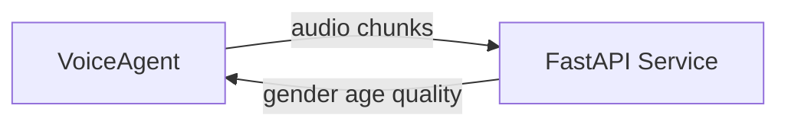
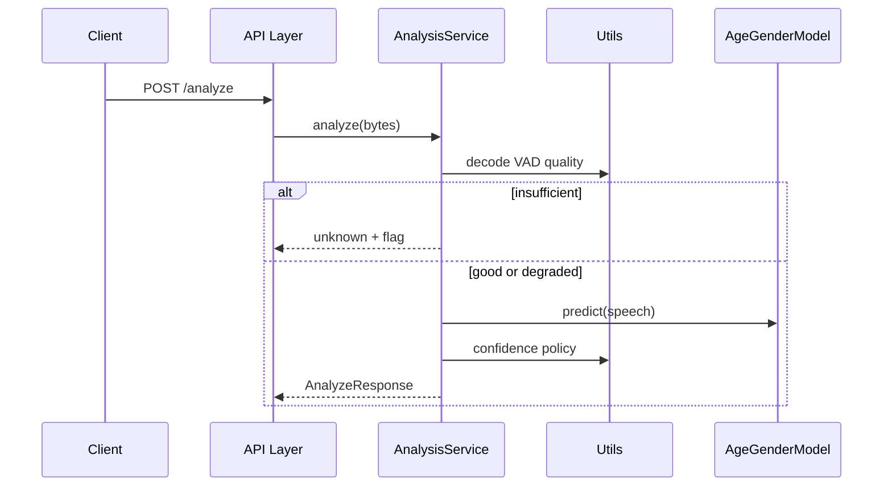

# Architecture

## System context

## Request flow

## Layering

| Layer | Path | Role |
|-------|------|------|
| API | `app/api/` | HTTP/WebSocket contracts, error mapping |
| Services | `app/services/` | Pipeline orchestration, stream sessions |
| Models | `app/models/` | ML inference only |
| Utils | `app/utils/` | Pure audio/policy functions |

**Rule:** `api → services → models | utils` (no upward imports).

## ADRs

### ADR-001: audeering wav2vec2-24 age-gender

**Decision:** Use `audeering/wav2vec2-large-robust-24-ft-age-gender`.  
**Rationale:** Single pass; trained for noisy speech; public weights; fits Docker-only constraint.  
**Rejected:** Whisper (latency), external APIs (portability).

### ADR-002: Quality gate before inference

**Decision:** Compute `audio_quality` before model forward pass.  
**Rationale:** Logistics calls have truck/warehouse noise; avoid confident wrong labels.  
**Rejected:** Infer-then-filter only.

### ADR-003: unknown + confidence floors

**Decision:** Return `unknown` when below thresholds; cap confidence when `degraded`.  
**Rationale:** Product trust over fake precision.

### ADR-004: ffmpeg decode

**Decision:** Normalize all codecs via ffmpeg to 16 kHz mono.  
**Rationale:** Telephony formats (μ-law, MP3, GSM).

### ADR-005: webrtcvad pre-model

**Decision:** Extract speech segments before inference.  
**Rationale:** Less non-speech; better SNR estimates.

### ADR-006: CPU preload in lifespan

**Decision:** Load model at startup; `/health` reflects readiness.  
**Rejected:** Per-request download.

### ADR-007: Shared AnalysisService

**Decision:** REST and WebSocket use the same service.  
**Rejected:** Duplicate pipelines.

## Scaling to 1,000 concurrent calls

Not implemented in this repo; intended production evolution:

1. **Stateless API tier** — FastAPI pods handle I/O, VAD, quality (CPU-light).
2. **Inference worker pool** — GPU nodes consume Redis Streams/Kafka jobs; gRPC return path.
3. **WebSocket** — Sticky sessions; ~200–300 connections per pod; backpressure when queue depth high.
4. **ONNX/TensorRT** — 2–4× throughput for wav2vec2.
5. **Batching** — Workers batch 8–16 requests per 20–50ms window.
6. **Sizing** — Assume ~1 inference per 5s window per call, staggered; ~30–50 inferences/s per T4 with ONNX → order-of-magnitude 20–40 GPU workers for 1k calls (explicit assumptions in runbooks).

## Observability

- `X-Request-Id`, `X-Process-Time-Ms` headers
- Structured JSON logs: `request_id`, `contact_id`, `stage`, `processing_ms`, `audio_quality`
- Per-stage timings inside `AnalysisService`
