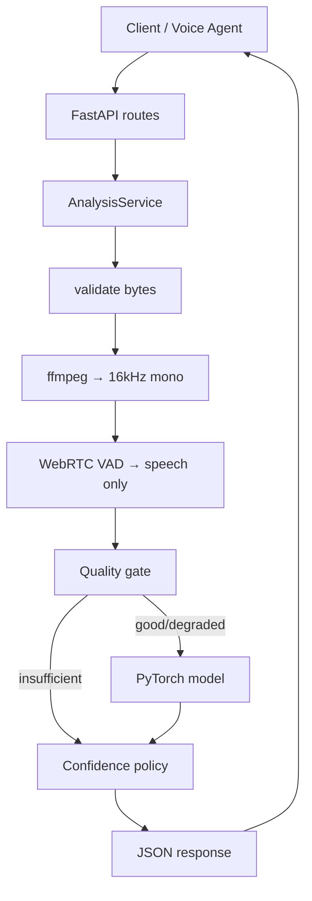
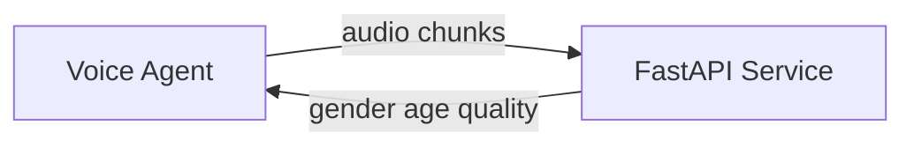

# Ironman — Project Walkthrough (Node.js Developer Guide)

**Ironman** is a small backend that listens to caller audio and returns **estimated gender** and **age bracket** (with confidence scores). It is built for noisy logistics / telephony calls, so it often returns `unknown` rather than a wrong guess.

Think of it as: **Express/Fastify + WebSocket + one heavy ML model loaded at startup**.

---

## What problem it solves

A voice agent (or your app) sends audio from a phone call. Ironman answers:

- Male / female / unknown
- Age bucket: `18-30`, `31-45`, `46-60`, `60+`, or `unknown`
- How trustworthy that is (`confidence`)
- Whether the audio was good enough (`audio_quality`: `good` | `degraded` | `insufficient`)

This is for **UX personalization**, not identity verification.

---

## Node.js ↔ Python map

| Node.js | This project |
|--------|----------------|
| Express / Fastify | **FastAPI** (`app/main.py`) |
| `process.env` + `dotenv` | **Pydantic Settings** (`app/config.py`, prefix `VOICE_`) |
| Zod / Joi schemas | **Pydantic** (`app/schemas.py`) |
| `app.locals` / singleton services | **`app.state`** (model + `AnalysisService` on startup) |
| Middleware (`req.on('finish')`) | **`TimingMiddleware`** |
| `multer` file upload | Multipart handled in `analyze.py` |
| `ws` WebSocket server | **`/ws/stream`** in `stream.py` |
| `child_process` + ffmpeg | **`audio_decode.py`** shells out to ffmpeg |
| Jest | **pytest** (`tests/`) |
| `npm start` → `node index.js` | **`uvicorn app.main:app`** |

---

## Repo layout (mental model)

```
app/
  main.py              ← app entry (like server.js)
  config.py            ← env config
  schemas.py           ← API types (like shared Zod types)
  dependencies.py      ← inject services into routes
  api/                 ← HTTP + WS routes (controllers)
  services/            ← business orchestration
  models/              ← ML only (PyTorch)
  utils/               ← pure helpers (decode, VAD, quality, confidence)
  middleware/          ← request timing headers
scripts/               ← CLI clients & load tools (not the server)
tests/                 ← unit + integration
samples/               ← test WAV files
```

**Rule:** routes → services → models/utils. Routes do not call the model directly.

---

## How the server starts

### Docker (easiest)

```bash
docker compose up --build
```

Builds the image, downloads ~2GB model weights, exposes port **8000**.

### Local development

```bash
python -m venv .venv && source .venv/bin/activate
pip install -r requirements.txt
python scripts/generate_sample.py
uvicorn app.main:app --reload
```

### Startup lifecycle

On startup (`app/main.py` lifespan — similar to `app.listen()` plus async init):

1. Configures structured logging
2. Creates `AgeGenderInference()` and calls `model.load()` (unless tests skip it)
3. Loads Hugging Face model `audeering/wav2vec2-large-robust-24-ft-age-gender` once on CPU
4. Attaches `model` and `analysis_service` to `app.state` (shared for every request)
5. `GET /health` returns `model_loaded: true` when ready (orchestration readiness)

Tests set `VOICE_SKIP_MODEL_LOAD=true` so they run without downloading weights.

---

## Public API (three surfaces)

### 1. `GET /health`

Orchestration check: is the model loaded?

```bash
curl -s http://localhost:8000/health | jq
```

### 2. `POST /analyze` (one-shot, full file)

Two ways to send audio (multipart upload or raw body):

| Style | How |
|--------|-----|
| Multipart | `audio` file + optional `contact_id` |
| Raw body | `Content-Type: audio/wav` (or other) + optional `X-Contact-Id` |

The route handler (`app/api/analyze.py`) only reads bytes and delegates to `AnalysisService`:

- If `Content-Type` contains `multipart/form-data` → read form fields
- Otherwise → read raw `request.body()`

**Multipart example:**

```bash
curl -s -X POST http://localhost:8000/analyze \
  -F "audio=@samples/test_clip.wav" \
  -F "contact_id=$(uuidgen)" | jq
```

**Raw body example:**

```bash
curl -s -X POST http://localhost:8000/analyze \
  -H "Content-Type: audio/wav" \
  -H "X-Contact-Id: $(uuidgen)" \
  --data-binary @samples/test_clip.wav | jq
```

### 3. `WS /ws/stream` (live call, chunks)

**Protocol:**

1. Client sends JSON: `{"type":"config","contact_id":"..."}`
2. Server replies: `{"type":"ready", "contact_id": "..."}`
3. Client sends **binary** audio chunks (WAV fragments or raw PCM 16-bit 16 kHz mono)
4. Server may send **`partial`** predictions every ~1.5s
5. Client sends `{"type":"end"}` → server sends **`final`** result

**Smoke test:**

```bash
python scripts/ws_client.py samples/test_clip.wav
```

---

## End-to-end request flow

Both REST and WebSocket ultimately call the same **`AnalysisService.analyze()`** pipeline.



### Pipeline steps (`app/services/analysis_service.py`)

| Step | Module | What it does | Why |
|------|--------|----------------|-----|
| **validate** | `app/utils/audio_validate.py` | Size / non-empty checks | Reject bad uploads early |
| **decode** | `app/utils/audio_decode.py` | ffmpeg → 16 kHz mono float32 | Telephony uses many codecs (μ-law, MP3, etc.) |
| **vad** | `app/utils/vad.py` | Voice activity detection | Strip silence / background noise before ML |
| **quality** | `app/utils/quality.py` | Speech length, SNR, clipping | Label `good` / `degraded` / `insufficient` |
| **inference** | `app/models/age_gender_model.py` | One neural net forward pass | Gender + age from voice |
| **confidence** | `app/utils/confidence.py` | Thresholds + caps | Return `unknown` when not safe to guess |

If quality is **`insufficient`**, the model is **skipped** — the API returns `unknown` with 0 confidence (intentional degradation).

Each stage is timed; timings appear in structured logs as `stages`.

---

## What the ML model does

`AgeGenderInference` (`app/models/age_gender_model.py`) wraps PyTorch + Hugging Face **Wav2Vec2**:

- **Input:** float32 waveform (speech segment, capped by `VOICE_MAX_SPEECH_SECONDS`, default 5s)
- **Output:** gender probabilities (female / male / **child**) + age score mapped to 0–100 years
- **Policy** (`app/utils/confidence.py`) maps raw output to API fields:
  - High **child** probability → `unknown` (adult caller context)
  - Low margin between male/female → `unknown`
  - Below confidence floors → `unknown`
  - If audio was **`degraded`**, confidence is **capped** (e.g. max 0.6)

The model proposes; **confidence policy** decides what the API actually returns.

### Age bracket mapping

| Estimated age (years) | Bracket |
|----------------------|---------|
| &lt; 18 | `unknown` |
| 18–30 | `18-30` |
| 31–45 | `31-45` |
| 46–60 | `46-60` |
| &gt; 60 | `60+` |

---

## WebSocket-specific behavior

`StreamSession` (`app/services/stream_session.py`) accumulates chunks in a **rolling buffer** (max 30 seconds by default):

- Appends PCM16LE chunks or decodes WAV/FLAC/MP3 fragments
- Every **1.5 seconds** (if enough audio), re-runs `analyze()` on the buffer → `partial` event
- On `{"type":"end"}`, runs once more → `final` event, then clears the buffer

Streaming is “re-analyze the growing buffer,” not a separate streaming model.

---

## Response contract

```json
{
  "contact_id": "uuid",
  "gender": { "prediction": "male", "confidence": 0.87 },
  "age_bracket": { "prediction": "31-45", "confidence": 0.63 },
  "processing_ms": 142,
  "audio_quality": "good"
}
```

| Field | Meaning |
|-------|---------|
| `contact_id` | Correlation ID for the call/session (auto-generated UUID if omitted) |
| `gender.prediction` | `male` \| `female` \| `unknown` |
| `age_bracket.prediction` | `18-30` \| `31-45` \| `46-60` \| `60+` \| `unknown` |
| `*.confidence` | 0.0–1.0; may be capped when `audio_quality` is `degraded` |
| `processing_ms` | End-to-end server processing time |
| `audio_quality` | `good` \| `degraded` \| `insufficient` |

WebSocket `partial` / `final` events include the same prediction fields plus `type` and optional `buffer_ms`.

---

## Configuration

All environment variables use the prefix **`VOICE_`** (see `app/config.py`):

| Variable | Default | Purpose |
|----------|---------|---------|
| `VOICE_GENDER_MIN_CONF` | 0.55 | Minimum confidence to return male/female |
| `VOICE_AGE_MIN_CONF` | 0.45 | Minimum confidence to return an age bracket |
| `VOICE_DEGRADED_CONF_CAP` | 0.6 | Max confidence when audio is degraded |
| `VOICE_MIN_SPEECH_MS` | 500 | Minimum speech duration for inference |
| `VOICE_MIN_SNR_DB` | 6.0 | SNR threshold for `degraded` vs `good` |
| `VOICE_WS_PARTIAL_INTERVAL_SECONDS` | 1.5 | Partial update cadence on WebSocket |
| `VOICE_SKIP_MODEL_LOAD` | false | Skip model load (tests only) |

Same mental model as a Node `config.ts` reading `process.env`.

---

## Privacy and data handling

- Audio stays **in memory** for the request lifetime; no database or object storage
- ffmpeg may write a **temporary file** that is deleted in a `finally` block
- Logs contain metadata only (`contact_id`, timings, `audio_quality`) — never raw audio bytes
- Demographic outputs are **UX estimates**, not identity verification

---

## Development and testing

| Task | Command |
|------|---------|
| Run server (local) | `uvicorn app.main:app --reload` |
| Run tests | `pytest -q` |
| Docker smoke test | `docker compose up --build` |
| Generate sample WAV | `python scripts/generate_sample.py` |
| WebSocket client | `python scripts/ws_client.py samples/test_clip.wav` |
| WebSocket load test | `docker compose -f docker-compose.load.yml up` |

- **Unit tests** mock or skip the model; no Hugging Face download required
- **Integration tests** use a mocked model
- **Docker build** verifies the real model loads

---

## Typical integration story

1. A **voice platform** captures caller audio during a live call
2. Your service either:
   - **Batch:** `POST /analyze` with a clip when a segment ends, or
   - **Stream:** WebSocket chunks to `/ws/stream` for live UI hints
3. Your app (Node, Python, etc.) reads `gender`, `age_bracket`, and `audio_quality`
4. If `unknown` or `insufficient`, use neutral UX defaults
5. If `degraded`, treat predictions cautiously (confidence is capped)

Ironman does **not** store callers, authenticate users, or manage telephony — it is a **stateless inference microservice**.

---

## Architecture layering



| Layer | Path | Role |
|-------|------|------|
| API | `app/api/` | HTTP/WebSocket contracts, error mapping |
| Services | `app/services/` | Pipeline orchestration, stream sessions |
| Models | `app/models/` | ML inference only |
| Utils | `app/utils/` | Pure audio and policy functions |

Import rule: `api → services → models | utils` (no upward imports).

For ADRs and scaling notes, see [ARCHITECTURE.md](../ARCHITECTURE.md).

---

## Known limitations

- CPU inference may exceed 500ms on some hardware; production would use ONNX/GPU workers (described in ARCHITECTURE.md, not implemented in this repo)
- The audeering model is [CC-BY-NC-SA-4.0](https://huggingface.co/audeering/wav2vec2-large-robust-24-ft-age-gender) — confirm license fit before production
- Voice-based demographics can reflect dataset bias; not suitable for compliance or access control
- Heavy noise increases `degraded` / `unknown` responses — by design

---

## Related docs

- [README.md](../README.md) — quick start and API examples
- [ARCHITECTURE.md](../ARCHITECTURE.md) — ADRs, sequence diagrams, scaling
- [HANDOVER.md](../HANDOVER.md) — interview / discussion prep
- [DESIGN.md](../DESIGN.md) — design notes
